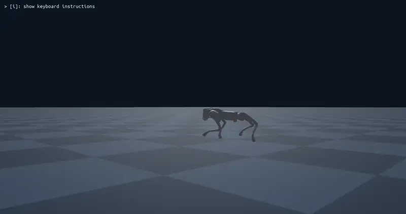

# PIP-Loco: Genesis Implementation for Unitree Go2

[](https://opensource.org/licenses/MIT)
[](https://www.python.org/downloads/)
[](https://pytorch.org/)
[](https://genesis-embodied-ai.github.io/)



A fast, robust, blind RL-based locomotion policy for the Unitree Go2 quadruped. Trains on a **single consumer laptop GPU** (RTX 3050 Ti) in **~4 hours (~160M steps)** using 1024 parallel environments in the Genesis physics simulator. Produces sim-to-real ready policies via aggressive domain randomization and hardware-safe Quadratic Barrier constraints.

For the deep dive into the math, architecture, and gradient isolation strategy, go through my **[Technical Blog](https://aceofspades07.github.io/blog/pip-loco.html)**.

---

## Quickstart

### Installation

```bash
# Clone the repository
git clone https://github.com/aceofspades07/pip-loco.git
cd pip-loco

# Create and activate conda environment
conda create -n pip_genesis python=3.10 -y
conda activate pip_genesis

# Install PyTorch with CUDA support
pip install torch==2.8.0+cu126 torchvision==0.23.0+cu126 --index-url https://download.pytorch.org/whl/cu126

# Install Genesis physics simulator
pip install genesis-world==0.3.10

# Install remaining dependencies
pip install numpy==2.1.2 pandas scipy matplotlib tensorboard wandb tqdm pygame libigl==2.5.1

# Install local packages in editable mode
pip install -e genesis_lr/
```

### Inference (Play)

```bash
# Run pre-trained policy with keyboard control
# W/S: Forward/Backward | A/D: Strafe | Arrows: Turn | R: Reset | ESC: Quit
python scripts/play.py
```

### Training

```bash
# Train from scratch (~4 hours on RTX 3050 Ti)
python scripts/train.py
```

Checkpoints are saved to `logs/pip_go2_<timestamp>/`.

---

## High-Level System Architecture

| Component | Description |
|-----------|-------------|
| **Asymmetric Actor-Critic** | Actor receives 45-dim blind proprioception (joint pos/vel, IMU, commands). Critic receives privileged simulator data (true velocity, friction, terrain heights). |
| **TCN Velocity Estimator** | 3-layer Temporal Convolutional Network (TCN) that regresses body velocity from 50-step observation history — no kinematic assumptions. |
| **Dreamer (No-Latent Model)** | 4 independent MLPs (dynamics, reward, policy, value) that predict future states. Generates 5-step 'dreamed' rollouts fed to the actor. |
| **HybridTrainer** | Coordinates three separate optimizers with strict gradient isolation: Estimator (supervised learning), Dreamer (model-based learning), PPO (policy learning). |

---

## Training Process Overview

**Environment Rollout:** The robot collects experience by interacting with 1024 parallel Genesis environments. Each step, the actor network outputs joint position targets based on proprioceptive observations (joint angles, velocities, IMU data, and velocity commands).

Training uses a **three-phase hybrid approach** that coordinates multiple learning objectives without gradient interference:

1. **Velocity Estimator Update:** A Temporal Convolutional Network (TCN) processes the last 50 timesteps of observations to estimate the robot's true body velocity. This is trained via supervised learning against ground-truth simulator data, giving the actor implicit velocity feedback without direct sensor access.

2. **Dreamer (World Model) Update:** Four small MLPs learn to predict future states, rewards, and values from the current observation. The dreamer "dreams" 5-step future rollouts, allowing the policy to plan ahead and anticipate consequences of actions. These 4 MLPs are trained via model-based supervised learning.

3. **PPO Policy Update:** The actor and critic networks are updated using Proximal Policy Optimization. The critic has access to privileged information (true velocity, terrain, friction) during training, while the actor remains blind — enabling sim-to-real transfer.

**Gradient Isolation:** Each component has its own optimizer. Gradients are explicitly detached between modules to prevent the estimator or dreamer losses from corrupting the policy, and vice versa.

A typical training run progresses through ~5000 iterations, with the robot initially falling immediately, then learning to stand, walk, and finally track velocity commands smoothly.

---

## Hardware Safety & Sim-to-Real Hardening

### Domain Randomization

- **Friction:** Uniform `[0.25, 1.25]`
- **Payload Mass:** Uniform `[-2.0, +3.0] kg`
- **External Pushes:** `1.0 m/s` lateral impulse every `5s`
- **Control Latency:** `0–2` policy steps (`0–10 ms` at 50 Hz)
- **PD Gains:** Multiplier `[0.8, 1.2]`
- **CoM Displacement:** `±5 cm` in each axis

### Quadratic Barrier Safety Constraints

The policy is penalized when approaching hardware limits—not just at violation:

| Limit | Unitree Go2 Spec | Soft Threshold (90%) |
|-------|------------------|----------------------|
| Max Torque | 45 Nm | 40.5 Nm |
| Max Joint Velocity | 30 rad/s | 27 rad/s |

Penalties scale quadratically as the robot approaches these limits, promoting smooth, hardware-safe motions.

---

## Configuration Guide

All hyperparameters and domain randomization ranges are centralized in:

```
config/pip_config.py
```

Key sections:
- `PIPGO2Cfg.env` — Number of parallel envs, observation dims, episode length
- `PIPGO2Cfg.domain_rand` — Friction, mass, push, and latency ranges
- `PIPGO2Cfg.rewards.scales` — Reward component weights
- `PIPTrainCfg.algorithm` — Learning rates, PPO clip, gradient norm
- `PIPTrainCfg.policy` — Actor/critic network dimensions, dreamer horizon

---

## 4-Beat Walk Gait Using PIP-Loco Framework

A 4-beat walk gait is a locomotion pattern where only one leg is in the air at any given time, cycling through each leg in sequence (FL → RR → FR → RL). This produces a stable, energy-efficient walking motion ideal for slow to moderate speeds, corresponding to a **75% duty factor** (each foot spends 75% of the gait cycle in stance). The PIP-Loco framework enforces this pattern through a **phase clock** with per-leg offsets and dedicated gait reward functions.

### Running the 4-Beat Gait

```bash
# Run the pre-trained 4-beat walk policy with keyboard control
# W/S: Forward/Backward | A/D: Strafe | Arrows: Turn | R: Reset | ESC: Quit
python scripts/4beat_gait.py
```

The script loads the latest checkpoint and opens a Pygame window for real-time velocity commands. Foot contact data is logged and saved to `gait_data.npy` on exit for gait phase analysis.

> **Note:** Update the `MODEL_PATH` variable at the top of `scripts/4beat_gait.py` to point to your desired checkpoint if you have trained a new model.

### Training from Scratch

All gait-related hyperparameters live in `config/pip_config.py`. To train a new 4-beat walk policy:

1. **Adjust gait and reward configs** in `config/pip_config.py`:
   - `PIPGO2Cfg.rewards.scales.gait_timing` — Weight for the phase-clock gait timing reward (default `3.0`).
   - `PIPGO2Cfg.rewards.scales.contact_number` — Weight for encouraging 3-foot contact (default `2.0`).
   - `PIPGO2Cfg.rewards.scales.foot_clearance` — Weight for swing-leg ground clearance (default `0.5`).
   - `PIPGO2Cfg.rewards.scales.feet_slip` — Penalty for foot slipping during stance (default `-0.1`).
   - Gait frequency and phase offsets are set in `envs/genesis_wrapper.py` (`gait_frequency`, `phase_offsets`).

2. **Launch training:**

```bash
python scripts/train.py
```

Checkpoints are saved to `logs/pip_go2_<timestamp>/`.

### Reward Functions

The 4-beat walk gait is shaped by two dedicated reward functions on top of the standard PIP-Loco reward functions:

- **Gait Timing (`_reward_gait_timing`):** Uses a phase clock with per-leg offsets to define the target swing/stance schedule. Compares actual foot contacts against the expected 4-beat pattern and rewards close adherence via an exponential kernel. Only active when a non-zero velocity command is given.
- **Contact Number (`_reward_contact_number`):** Encourages exactly 3 feet to be in ground contact at any instant, penalizing deviations from this target.

These are complemented by the **foot clearance** reward (ensuring the swing foot lifts sufficiently) and the **feet slip** penalty (discouraging stance-foot sliding), together producing a clean, hardware-safe walking gait.

---

## Roadmap

- [x] **Phase 1:** Concurrent training of the Asymmetric Actor-Critic, NLM Dreamer, TCN Velocity Estimator for Blind locomotion
- [ ] **Phase 2:** Model Predictive Path Integral (MPPI) planner integration
- [ ] **Phase 3:** Rough terrain curriculum and visual exteroception

---

## Acknowledgments & References

This implementation is based on **PIP-Loco : A Proprioceptive Infinite Horizon Planning Framework for Quadrupedal Robot Locomotion** by Shirwatkar et al. (ICRA 2025).

**Project Website:** [https://www.stochlab.com/PIP-Loco/](https://www.stochlab.com/PIP-Loco/)

**Citation:**
```bibtex
@misc{shirwatkar2024piplocoproprioceptiveinfinitehorizon,
    title={PIP-Loco: A Proprioceptive Infinite Horizon Planning Framework for Quadrupedal Robot Locomotion}, 
    author={Aditya Shirwatkar and Naman Saxena and Kishore Chandra and Shishir Kolathaya},
    year={2024},
    eprint={2409.09441},
    archivePrefix={arXiv},
    primaryClass={cs.RO},
    url={https://arxiv.org/abs/2409.09441}, 
}
```

**Additional Credits:**
- [Genesis Physics Simulator](https://genesis-embodied-ai.github.io/) — GPU-parallel rigid body simulation environment.
- [LeggedGym-Ex](https://github.com/lupinjia/LeggedGym-Ex) — Foundational environment wrapper (Formerly known as Genesis-LR).
- [RSL-RL](https://github.com/leggedrobotics/rsl_rl) — A library of simple implementations of learning algorithms for robotics. 

---

## License

This project is licensed under the MIT License. See [LICENSE](LICENSE) for details.
